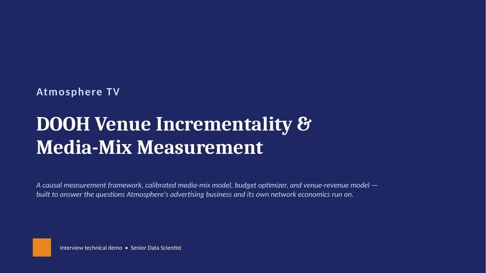
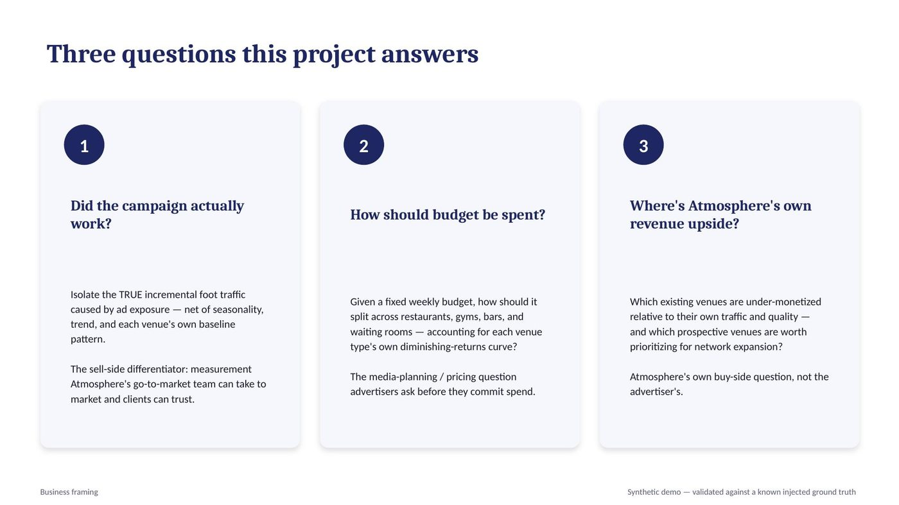
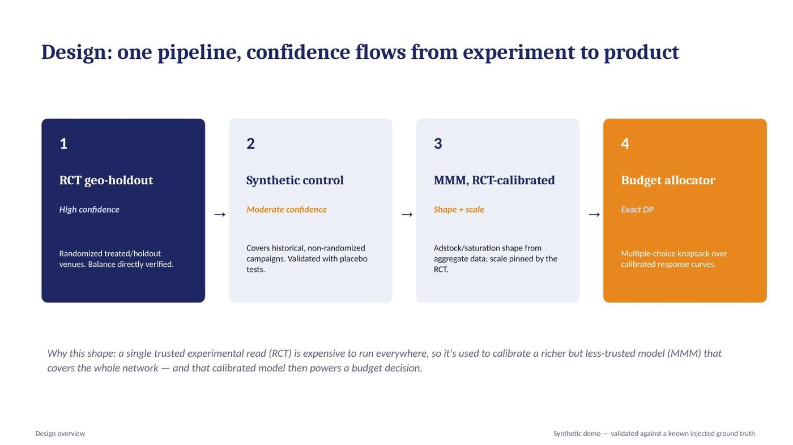
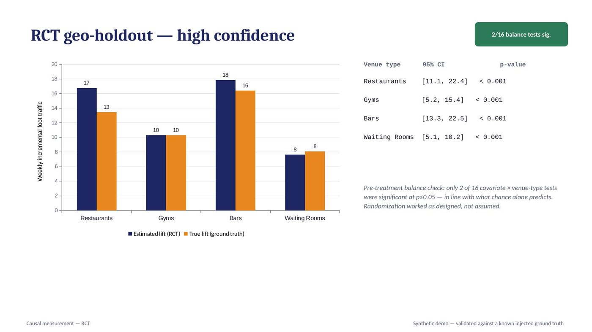
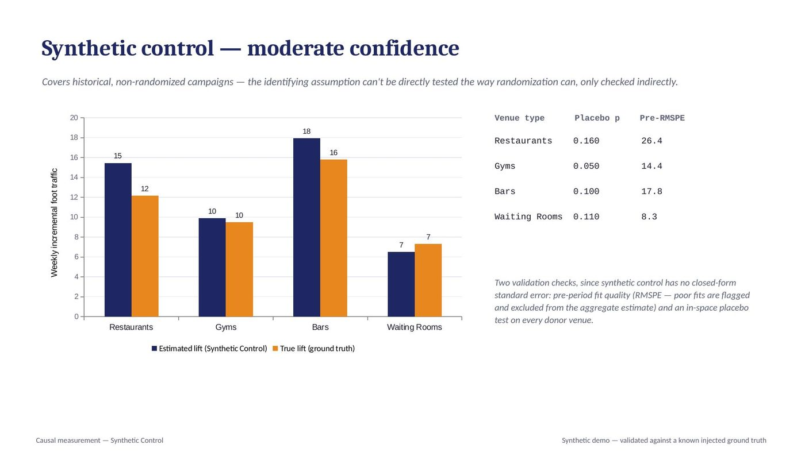
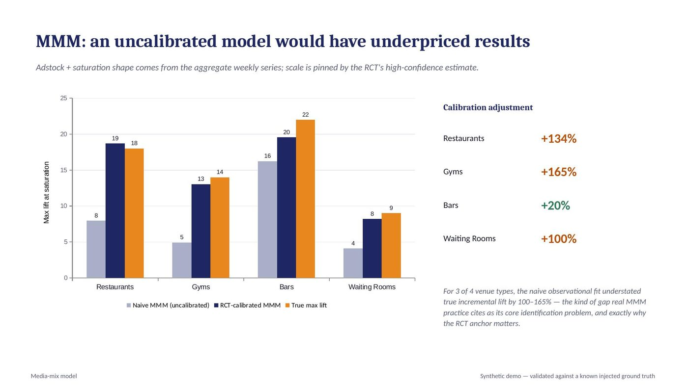
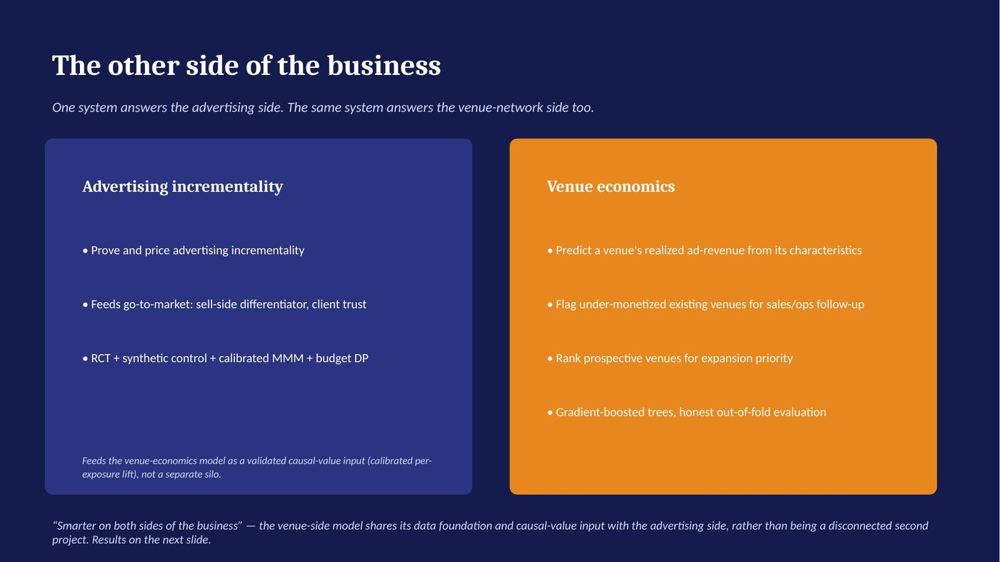
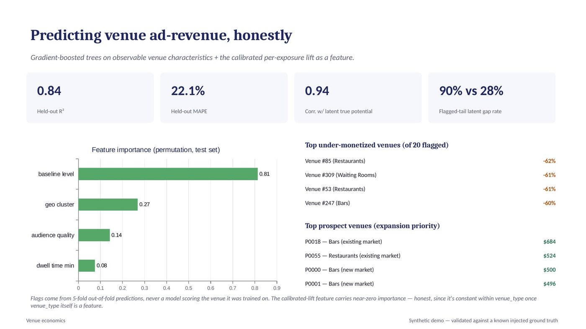
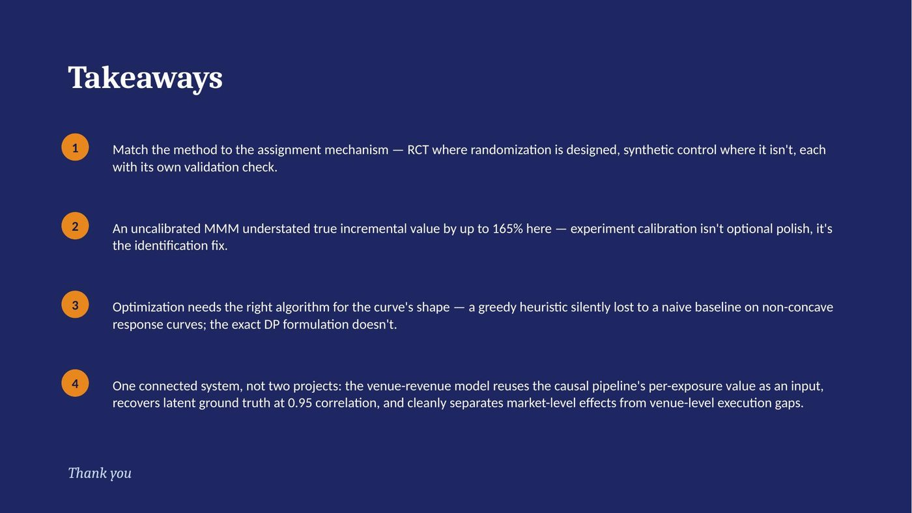

# Atmosphere TV: DOOH Venue Incrementality & Media-Mix Measurement

A technical demo project built for a Senior Data Scientist interview, answering the three
questions Atmosphere's business runs on:

1. **Did the campaign actually work?** — isolate the true incremental foot traffic caused
   by ad exposure, net of seasonality, trend, and each venue's own baseline pattern.
2. **How should budget be spent?** — given a fixed weekly budget, how should it be split
   across venue types (restaurants / gyms / bars / waiting rooms), accounting for each
   type's own diminishing-returns curve?
3. **Where's Atmosphere's own revenue upside?** — which existing venues are under-monetized
   relative to their own traffic and quality, and which prospective venues are worth
   prioritizing for network expansion?

> **This is a synthetic demo, not a claim about Atmosphere's real data or production
> systems.** Every dataset here is generated with a *known, injected ground-truth effect*
> — see [Honest scope](#honest-scope) — specifically so each method below can be validated
> against a known answer before being trusted conceptually.

## Slides

The full presentation, viewable right here — no download needed. (Editable source:
[`AtmosphereTV_DOOH_Measurement.pptx`](deck/AtmosphereTV_DOOH_Measurement.pptx); a
[PDF](deck/AtmosphereTV_DOOH_Measurement.pdf) is also included, which GitHub opens inline
in-browser if you'd rather page through it there.)

<p align="center">
<br>
<br>
<br>
<br>
<br>
<br>
<br>
<br>
<br>
<br>
<br>

</p>

## Design

One pipeline, not four disconnected methods. Confidence flows from a designed experiment
into the models that scale it across the whole network:

| Stage | Method | Confidence | Why |
|---|---|---|---|
| 1 | **RCT geo-holdout** | High | Venues are randomly split treated/holdout within `venue_type × geo_cluster × traffic_tier` strata. Balance is directly verified (Table 1 check), not assumed. |
| 2 | **Synthetic control** | Moderate | Covers historical, non-randomized campaigns where advertisers self-selected which venues to activate. Validated with pre-period fit quality (RMSPE) and an in-space placebo test — synthetic control has no closed-form standard error. |
| 3 | **Media-mix model (MMM)** | Shape from data, scale from RCT | Adstock + saturation curves fit on the aggregate weekly exposure series are not causally identified on their own — the RCT's point estimate is used to *calibrate* the model's scale, while its shape (decay, saturation) comes from the richer aggregate series. |
| 4 | **Budget allocator** | Exact DP | An exact dynamic-programming (multiple-choice knapsack) solve over the calibrated response curves — **not** a greedy marginal-value walk. A Hill/S-shaped response curve is convex before its inflection point, so a greedy heuristic isn't guaranteed optimal; an earlier greedy version of this allocator measurably underperformed a naive equal-split baseline. The DP has no concavity requirement and is guaranteed to find the grid-optimal allocation. |
| 5 | **Venue revenue model** | GBT, honest OOF | A gradient-boosted-trees model predicts each venue's realized ad revenue from observable characteristics *plus the RCT-calibrated per-exposure lift from stage 1–3 as a feature* — one connected pipeline, not a separate project bolted on. 5-fold out-of-fold predictions (never a model scoring the venue it was trained on) power under-monetization flags on existing venues; the same model, refit on all existing venues, scores never-before-seen prospects for expansion priority. |

## Key results (synthetic, see `outputs/tables/`)

- **RCT balance check**: 2 of 16 covariate × venue-type tests significant at p≤0.05 — in
  line with chance alone, consistent with randomization working as designed.
- **RCT effect recovery**: estimated lift within ~0.4–3.3 units of the injected ground
  truth across all four venue types (see `outputs/tables/rct_effects.csv`).
- **MMM calibration matters**: the naive, uncalibrated MMM understated true incremental
  lift by **100–165%** for 3 of 4 venue types before RCT calibration
  (`outputs/tables/mmm_params.csv`).
- **Budget allocator**: the exact-DP allocation beats a naive equal-split baseline by
  **+48.6%** at a $20K weekly budget, narrowing to +2.4% at $100K — the optimizer's edge
  is largest exactly when budget is scarce and allocation decisions matter most
  (`src/budget_allocator.py`).
- **Venue revenue model**: held-out R² = **0.84**, MAPE = **22.1%**, and —
  since this is synthetic data with an injected latent "true potential" the model never
  sees — predictions correlate **0.95** with that latent ground truth on both existing
  and never-before-seen prospect venues (`outputs/tables/venue_revenue_model_eval.csv`).
  The 20 most under-monetized venues by out-of-fold residual carry a **90%** latent
  under-monetization rate vs. **28%** network-wide — strong enrichment in the flagged
  tail, even though the residual correlates only weakly with latent efficiency across the
  *full* population (see [Honest scope](#honest-scope)).

## Repo layout

```
src/
  data_generation.py          # synthetic venues + weekly panel + injected ground truth
  causal_rct.py                # RCT geo-holdout: balance check + effect estimation
  causal_synthetic_control.py  # synthetic control: donor weighting + placebo test
  mmm_model.py                  # adstock/saturation MMM + RCT calibration
  budget_allocator.py           # exact DP budget allocation across venue types
  venue_economics_data.py       # synthetic venue revenue economics + prospect venues
  venue_revenue_model.py        # GBT revenue model, OOF under-monetization flags, prospect ranking
data/                          # generated venues.csv, weekly_panel.csv, ground_truth.json,
                                # venue_economics.csv, prospect_venues.csv, venue_economics_ground_truth.json
outputs/tables/                # every script's output tables (effect estimates, params)
outputs/figures/               # (reserved for exported static figures)
dashboard/
  streamlit_app.py              # interactive dashboard — run: streamlit run dashboard/streamlit_app.py
deck/
  build_deck.js                  # pptxgenjs script that builds the presentation deck
  deck_data.json                 # numbers pulled from outputs/tables/ for the deck
  AtmosphereTV_DOOH_Measurement.pptx  # editable source
  AtmosphereTV_DOOH_Measurement.pdf   # same deck, opens inline in GitHub's file viewer
  slides/                         # per-slide .jpg renders, embedded in this README
```

## Running it

```bash
pip install pandas numpy scipy scikit-learn statsmodels streamlit

python3 src/data_generation.py            # 1. generate synthetic data + ground truth
python3 src/causal_rct.py                  # 2. RCT geo-holdout effects (high confidence)
python3 src/causal_synthetic_control.py    # 3. synthetic control effects (moderate confidence)
python3 src/mmm_model.py                    # 4. MMM, calibrated against the RCT
python3 src/budget_allocator.py             # 5. budget allocation examples (CLI)
python3 src/venue_economics_data.py         # 6. synthetic venue revenue economics + prospects
python3 src/venue_revenue_model.py          # 7. venue revenue model, OOF flags, prospect ranking

streamlit run dashboard/streamlit_app.py    # interactive dashboard (5 tabs)
```

## Venue revenue: the other side of the business

The pipeline above answers the *advertising* side — proving and pricing incrementality,
which feeds Atmosphere's go-to-market motion as a sell-side differentiator. This part
answers Atmosphere's other growth lever, its *venue network*: which existing venues are
under-monetized relative to their own traffic and quality, and which prospective venues
are worth prioritizing for expansion.

**Design**: a gradient-boosted-trees model (`HistGradientBoostingRegressor`) predicts each
venue's realized weekly ad revenue from observable characteristics (venue_type,
geo_cluster, traffic tier, baseline traffic, screen count, dwell time, audience quality)
plus the RCT-calibrated per-exposure lift from the causal/MMM pipeline as a feature — the
connective tissue that keeps this one pipeline, not two disconnected projects. Two uses of
the same model:

- **Under-monetization flags** on existing venues, from 5-fold *out-of-fold* predictions
  (no venue is ever scored by a model that saw its own revenue) — surfacing venues worth a
  sales/ops look (pricing, fill rate, advertiser awareness).
- **Expansion-priority ranking** for prospective venues never in the network, scored on
  characteristics a scouting/leasing team could observe pre-signature (no revenue history
  needed), using the same model refit on all existing venues.

**Validation, same ground-truth-first discipline used throughout**: this synthetic demo injects
a latent "true ad-revenue potential" (driven by traffic, inventory, audience quality, and
a latent per-geo advertiser-demand multiplier) and a latent "monetization efficiency"
(a few structurally under-covered geo markets, plus independent venue-level execution
gaps) — neither is ever given to the model. The model's predictions recover the latent
potential at **0.95 correlation** on both existing and prospect venues, and the flagged
under-monetization tail carries a **90%** latent-gap rate vs. **28%** network-wide — see
[Key results](#key-results-synthetic-see-outputstables) above and
[Honest scope](#honest-scope) for the nuance on why that enrichment is strong in the tail
but the residual correlates only weakly with efficiency across the *whole* population
(geo-level effects get correctly absorbed into the prediction itself, since geo_cluster is
an observed feature — the residual is deliberately measuring deviation from peers, not
absolute efficiency).

## Honest scope

- **All data is synthetic**, generated with a known injected ground-truth effect used to
  validate that each method recovers it. Not a claim about any real company's data or
  systems.
- **The venue-revenue model's rate card, demand multipliers, and monetization-efficiency
  structure are illustrative demo parameters** (`BASE_WEEKLY_AD_RATE` in
  `src/venue_economics_data.py`), not a researched real Atmosphere rate card or actual
  venue economics.
- **The under-monetization residual is a tail-enrichment signal, not a population-wide
  linear one** — worth naming plainly rather than glossing over: across all 400 venues,
  `gap_pct` correlates only weakly with the latent monetization-efficiency draw (most
  venues' gap is dominated by ordinary noise), but the most extreme 20 venues by that same
  residual carry a 90% latent-gap rate vs. 28% network-wide. That's expected, not a flaw:
  geo-level structural effects are already absorbed into the prediction itself (geo_cluster
  is an observed feature), so the residual is specifically isolating compounding,
  venue-level anomalies — which is exactly the kind of signal worth a sales/ops follow-up,
  read correctly as a ranked shortlist rather than a precise efficiency score per venue.
- **Media-effectiveness figures** (dwell time, screen count, audience-quality score)
  shown around the dashboard are illustrative demo parameters, not researched real
  industry benchmarks. In production these would come from Nielsen OOH ratings, DSP data
  (e.g. Vistar), or Atmosphere's own play logs.
- **Multi-touch attribution (MTA) was deliberately not built.** Atmosphere's ambient-
  screen exposure model has no individual-level, cross-venue touchpoint log by default —
  building MTA would require purchased mobile location/device-matching data, a real but
  non-default assumption. Rather than force a model onto a data structure that doesn't
  exist, MTA is scoped out and the reason is named directly.
- **Cost-per-frequency-unit assumptions** behind the budget allocator are illustrative,
  editable placeholders (see `DEFAULT_COST_PER_FREQ_UNIT` in `src/budget_allocator.py`),
  not a researched Atmosphere rate card.
- **A real production deployment** would additionally need independent model-risk
  validation (documented intended use, assumptions, and limitations; a conceptual-
  soundness review by a separate team; ongoing monitoring of whether estimated effects
  hold up over time), none of which is in scope for this demo.
